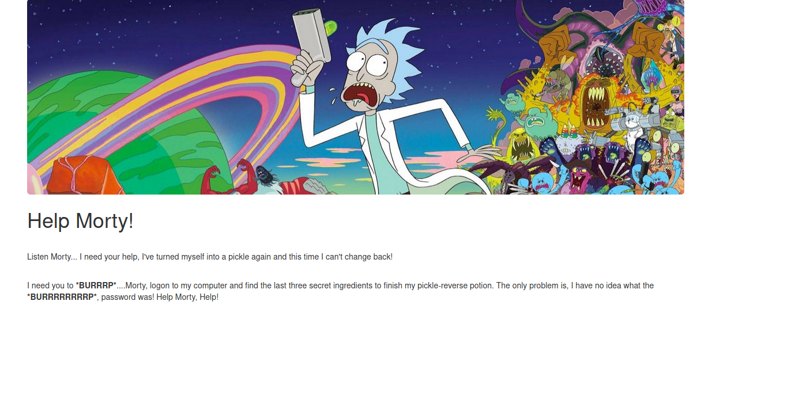
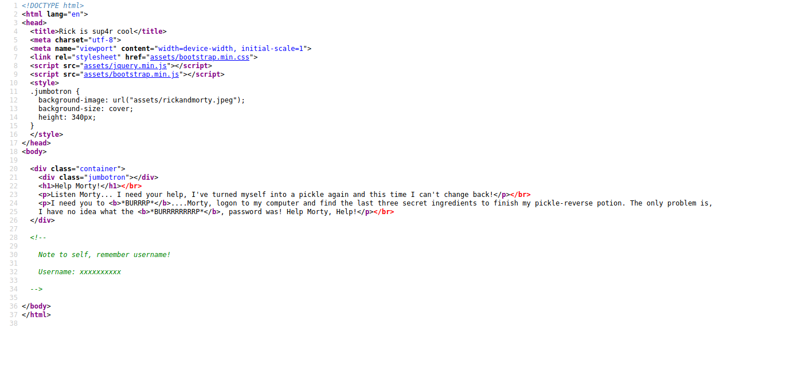
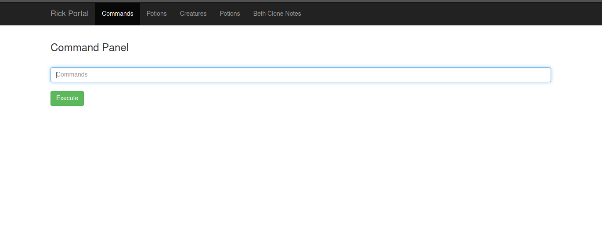
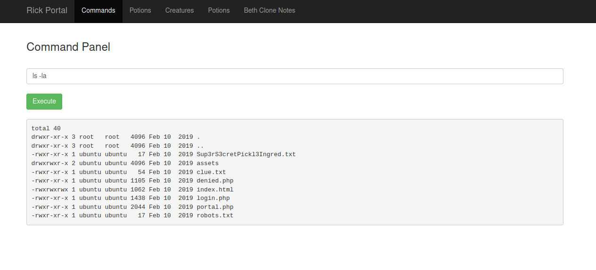
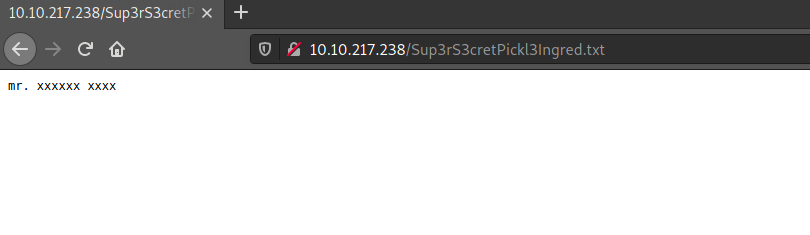

# Pickle Rick Writeup - Easy 

This is a walkthrough of the "Pickle Rick" Room on <a href="https://tryhackme.com">TryHackMe.com</a>. 

**URL:** https://tryhackme.com/room/picklerick


<h1 style="color:Red">I encourage everyone to try completing the tasks without any help. Only use this sheet if you're stuck.</h1>


# Table of contents
- [Tools used](#tools-used)
- [Lets get going](#lets-get-going)
  - [What are we dealing with?](#what-are-we-dealing-with)
  - [Enumerating the website](#enumerating-the-website)
  - [Finding Credentials](#finding-credentials)
  - [1st Ingredient](#1st-ingredient)
  - [2nd Ingredient](#2nd-ingredient)
  - [3rd Ingredient](#3rd-ingredient)


# Tools Used
- Nmap (https://nmap.org/)
- gobuster (https://github.com/OJ/gobuster)

# Lets get going:

## What are we dealing with?
---
Once you've deployed the machine, it's always good to run a nmap scan. So that's what we'll do. I like to save the IP as a variable, so you can use $IP on your machine. Can be done the following way: ```export IP=xx.xxx.xxx.xx```
```bash
└─$ nmap -sC -sV $IP -oN nmapscan
```
When the scan is complete, we get a result looking something like <a href="nmapscan">this</a>.

```
# Nmap 7.91 scan initiated Tue Apr 27 19:00:25 2021 as: nmap -sC -sV -oN nmapscan 10.10.217.238
Nmap scan report for 10.10.217.238
Host is up (0.042s latency).
Not shown: 998 closed ports
PORT   STATE SERVICE VERSION
22/tcp open  ssh     OpenSSH 7.2p2 Ubuntu 4ubuntu2.6 (Ubuntu Linux; protocol 2.0)
| ssh-hostkey: 
|   2048 aa:8b:cf:f6:54:ac:27:fe:c6:b1:a5:a8:63:57:31:38 (RSA)
|   256 37:e0:a3:58:c7:bf:ae:b3:b6:af:55:65:fa:e2:6c:0f (ECDSA)
|_  256 0d:d4:cb:89:87:2b:ee:36:f6:9c:f6:db:b7:5e:97:d8 (ED25519)
80/tcp open  http    Apache httpd 2.4.18 ((Ubuntu))
|_http-server-header: Apache/2.4.18 (Ubuntu)
|_http-title: Rick is sup4r cool
Service Info: OS: Linux; CPE: cpe:/o:linux:linux_kernel

```

We're able to see that port 80 and 22 is open. Which means there is a webserver and a ssh server running.

First we'll visit the website. It looks like this.



## Enumerating the website 
---
A good tool to run when you're dealing with a website is gobuster.

```bash
└─$ gobuster dir -u http://$IP/ -w /usr/share/wordlists/dirbuster/directory-list-2.3-medium.txt --x php,html,css,js,py,sh,txt -o gobuster -f

/index.html           (Status: 200) [Size: 1062]
/login.php            (Status: 200) [Size: 882]
/icons/               (Status: 403) [Size: 294]
/assets/              (Status: 200) [Size: 2192]
/portal.php           (Status: 302) [Size: 0] [--> /login.php]
/robots.txt           (Status: 200) [Size: 17]
```
After running the gobuster scan, we can see some common files and a ``portal.php`` file. Going to ``portal.php`` redirects us to ``login.php``. The site require a username and password, but we don't any of that.

## Finding Credentials
---

Looking at the sourcecode of the front page, we can see a hidden note with a username. We're going to write that down.



Great! We now have a username, but we still need to find the password.

Another good place to look for potential vulnerable/hidden pages are in the ``robots.txt`` file. Going to the ``http://<MACHINE_IP>/robots.txt`` file, we find a weird string. Maybe that could be the password.

Logging in using the noted username and the string we just found on the ``http://<MACHINE_IP>/portal.php`` page worked!

## 1st Ingredient
---

We have now access to a page that looks like this:



We can see there is a commandline. Typing the ``ls -la`` command lists all the files in the directory.



We find a file called ``Sup3rS3cretPickl3Ingred.txt``. Going to ``http://<MACHINE_IP>/Sup3rS3cretPickl3Ingred.txt`` we find the first ingredient!



## 2nd Ingredient
---

Running the ``ls -la`` also told us, there was a ``clue.txt`` file. Opening that file, teels us ``Look around the file system for the other ingredient.``


I just thought of listing the files in the ``home`` directory, so i did ``ls /home`` and then ``ls /home/rick``, because the user is called rick. We find another file called ``second ingredents``. Trying using the ``cat`` command didn't work, because it apparently was disabled. So i used the ``less`` command instead. ``less /home/rick/"second ingredients"`` and that gives us the second ingredient!

## 3rd Ingredient
---


We've now successfully found 2 ingredients, we only need one now. Just guessing around for paths on the machine was not in my interest. So i decided to look which permissions i may have on the machine. ``sudo -l`` - this told me i could do anything without any password, SWEET!

Commonly in challanges, they hide flag etc. in the root directory. Using the command ``sudo ls /root`` tells us there is a file called ``3rd.txt``. Using the ``less`` command to print the file again ``sudo less /root/3rd.txt`` and there we go! We found the last flag!
